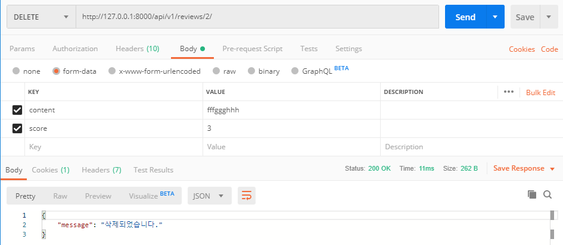

# 08 - REST API

## 데이터베이스 설계

* genres

  ```python
  class Genre(models.Model):
      name = models.CharField(max_length=100)
  ```

* movies

  ```python
  class Movie(models.Model):
      title = models.CharField(max_length=100)
      audience = models.IntegerField()
      poster_url = models.CharField(max_length=100)
      description = models.TextField()
      genre = models.ForeignKey(Genre, on_delete=models.CASCADE)
  ```

* reviews

  ```python
  class Review(models.Model):
      content = models.CharField(max_length=100)
      score = models.IntegerField()
      movie = models.ForeignKey(Movie, on_delete=models.CASCADE)
  ```

  

## Serializer

* serializers 설치

  ```bash
  $ pip install rest_framework
  ```

  ```python
  # 설치 후 settings/INSTALLED_APPS에 추가
  
  INSTALLED_APPS = [
      'rest_framework',
  ]
  ```

  ```python
  # movies에 serializers.py 만들고 serializers와 models 불러오기
  from rest_framework import serializers
  from .models import Genre, Movie, Review
  ```

* GenreSerializers

  ```python
  class GenreSerializers(serializers.ModelSerializer):
      class Meta:
          model = Genre
          fields = ['id', 'name']
  ```

  * id와 name 불러오기

  

* MovieSerializers

  ```python
  class MovieSerializers(serializers.ModelSerializer):
      class Meta:
          model = Movie
          fields = '__all__'
  ```

  * 모든 필드 불러오기

  

* GenreDetailSerializers

  ```python
  class GenreDetailSerializers(serializers.ModelSerializer):
      movie_set = MovieSerializers(many=True)
      class Meta(GenreSerializers.Meta):
          fields = GenreSerializers.Meta.fields + ['movie_set']
  ```

  * movie_set에 movie 정보들을 불러오고 genre 정보에 movie_set을 결합


* ReviewSerializer

  ```python
  class ReviewSerializer(serializers.ModelSerializer):
      class Meta:
          model = Review
          fields = ['content', 'score']
  ```

  * content와 score 불러오기


## Seed Data 반영

```bash
# movies/fixtures에 movie.json과 genre.json 파일을 옮긴 후 다음 명령어 실행
$ python manage.py loaddata genre.json
$ python manage.py loaddata movie.json
```


## RESTful

* dsf-yasg 설치

  ```bash
$ pip install drf-yasg
  ```
  
* settings.py에 추가

    ```python
    # 설치 후 settings/INSTALLED_APPS에 추가
    
    INSTALLED_APPS = [
        'dsf_yasg',	# INSTALLED_APPS에는 모두 언더바(_)로 저장, 설치명과 다름
    ]
    ```

* urls.py에 schema_view 반영

    ```python
    from drf_yasg.views import get_schema_view
    from drf_yasg import openapi
    
    
    schema_view = get_schema_view(
        openapi.Info(
            title='Snippets API',
            default_version='v1',
            description='Test description',
        ),
    )
    ```

* views.py에 필요한 것들 import 하기

    ```python
    from django.shortcuts import render, get_object_or_404
    from rest_framework.response import Response
    from rest_framework.decorators import api_view
    
    from django.contrib.auth import get_user_model
    from .models import Genre, Movie, Review
    from .serializers import GenreSerializers, GenreDetailSerializers, MovieSerializers, ReviewSerializer
    ```

    


## `movies` API

1. 장르 목록: `GET/api/v1/genres/`

   * urls.py

     ```python
     path('genre/', views.genre_index, name='genre'),
     ```

     

   * views.py

     ```python
     @api_view(['GET'])
     def genre_index(request):
         '''
         장르 정보
         '''
         genres = Genre.objects.all()
         serializer = GenreSerializers(genres, many=True)
         return Response(serializer.data)
     ```
     
     * 읽는 것으므로 GET 요청
     
   * 스크린샷

2. 장르 세부 정보: `GET/api/v1/genres/{genre_pk}/`

   * urls.py

     ```python
     path('genre/<int:genre_pk>/', views.genre_detail, name='genre_detail'),
     ```

     

   * views.py

     ```python
     @api_view(['GET'])
     def genre_detail(request, genre_pk):
         '''
         장르 상세 정보
         '''
         genre = get_object_or_404(Genre, pk=genre_pk)
         serializer = GenreDetailSerializers(genre)
         return Response(serializer.data)
     ```
     
     * 읽는 것이므로 GET 요청
     
   * 스크린샷

3. 영화 목록: `GET/api/v1/movies/`

   * urls.py

     ```python
     path('movies/', views.movie_index, name='movie'),
     ```

     

   * views.py

     ```python
     @api_view(['GET'])
     def movie_index(request):
         '''
         영화 정보
         '''
         movies = Movie.objects.all()
         serializer = MovieSerializers(movies, many=True)
         return Response(serializer.data)
     ```
     
     * 읽는 것이므로 GET 요청
     
   * 스크린샷

     

4. 영화 세부 정보: `GET/api/v1/movies/{movie_pk}/`

   * urls.py

     ```python
     path('movies/<int:movie_pk>/', views.movie_detail, name='movie_detail'),
     ```

     

   * views.py

     ```python
     @api_view(['GET'])
     def movie_detail(request, movie_pk):
         '''
         영화 상세 정보
         '''
         movie = get_object_or_404(Movie, pk=movie_pk)
         serializer = MovieSerializers(movie)
         return Response(serializer.data)
     ```
     
     * 읽는 것이므로 GET 요청
     
   * 스크린샷

     

5. 평점 등록: `POST/api/v1/movies/{movie_pk}/reviews/`

   * urls.py

     ```python
     path('movies/<int:movie_pk>/reviews/', views.reviews, name='reviews'),
     ```

     

   * views.py

     ```python
     @api_view(['POST'])
     def reviews(request, movie_pk):
         movie = get_object_or_404(Movie, pk=movie_pk)
         '''
         평점 등록
         '''
         serializer = ReviewSerializer(data=request.data)
         if serializer.is_valid(raise_exception=True):
             serializer.save(movie_id = movie_pk)
         return Response({'message':'작성되었습니다.'})
     ```
     
     * 등록이므로 POST 요청
     * raise_exception=True를 통해 입력되지 않은 데이터가 있으면 넘어가지 않게함
     
   * 스크린샷

     

6. 평점 수정 및 삭제: `PUT/api/v1/reviews/{review_pk}/`

   * urls.py

     ```python
     path('reviews/<int:review_pk>/', views.review_update_delete, name='review_update_delete'),
     ```

     

   * views.py

     ```python
     @api_view(['PUT', 'DELETE'])
     def review_update_delete(request, review_pk):
         review = get_object_or_404(Review, pk=review_pk)
         if request.method == 'PUT':
             serializer = ReviewSerializer(data=request.data, instance=review)
             if serializer.is_valid(raise_exception=True):
                 serializer.save()
                 return Response({'message': '수정되었습니다.'})
         else:
             review.delete()
             return Response({'message': '삭제되었습니다.'})
     ```
     
     * 수정하는 PUT, 삭제하는 DELETE
     * request.method가 PUT이라면 수정하기, 아니라면 삭제하기
     * raise_exception=True를 통해 입력되지 않은 데이터가 있으면 넘어가지 않게함
     
   * 스크린샷
   
     
   
     


